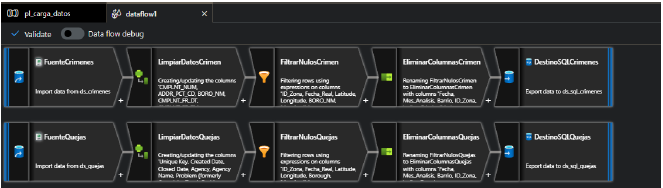
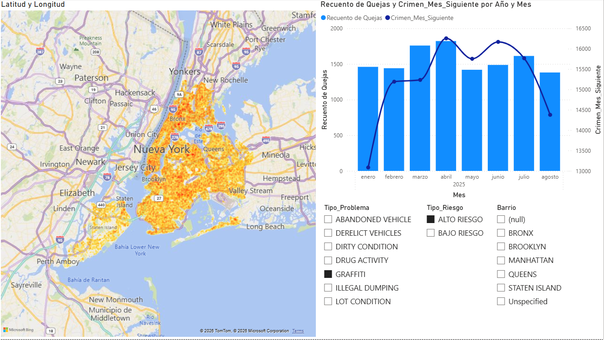
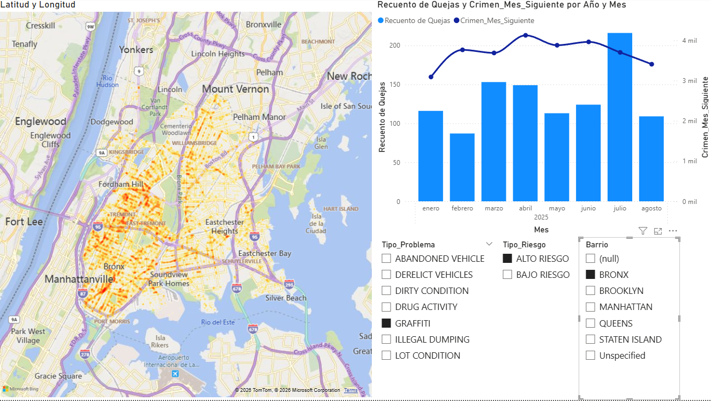
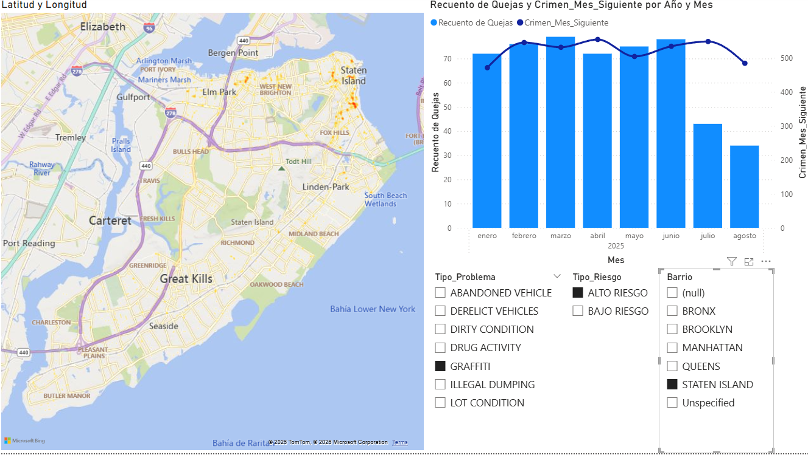
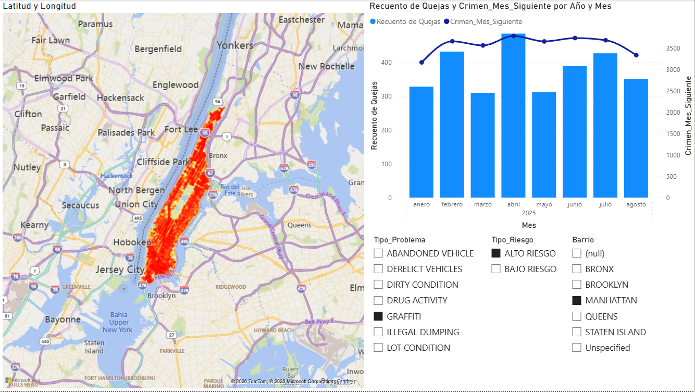
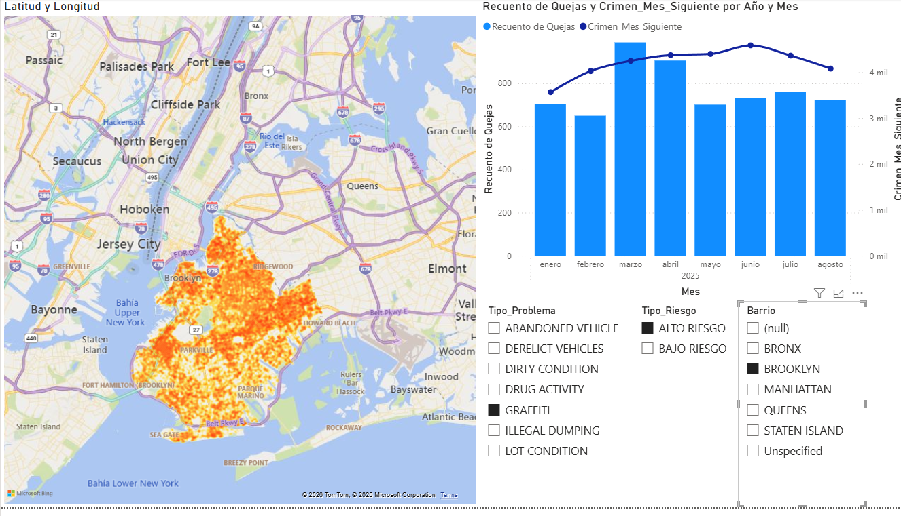
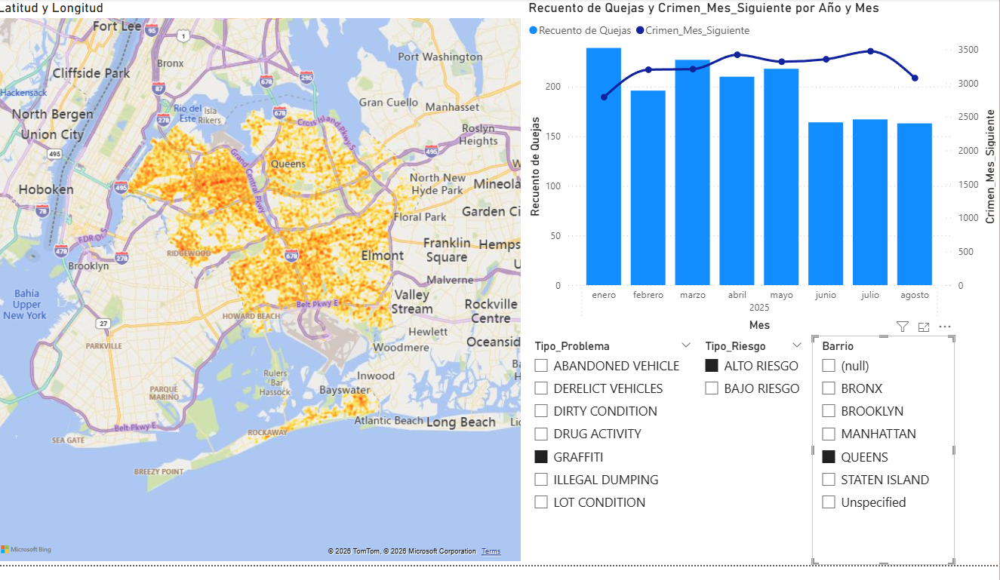
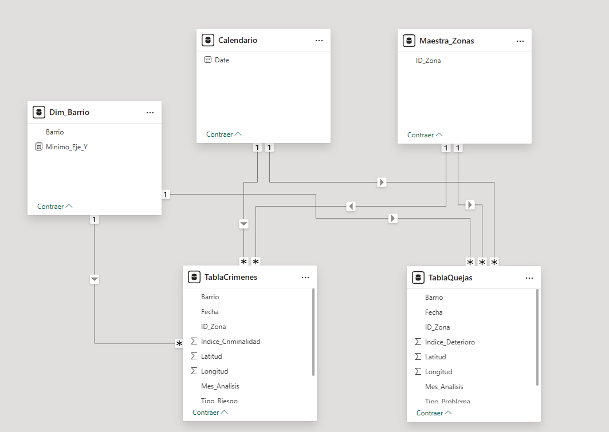

# Urban Crime Prediction with Azure & Open Data

> > **Note:** The comprehensive final executive report included in the `docs/` folder is originally written in Spanish as it was presented as the final project for the Information Analysis for Big Data course. However, this README covers the complete technical architecture, methodologies, DAX logic, and business outcomes in English.

## Project Overview
Traditional policing relies heavily on a reactive model—waiting for a 911 call. This project aims to shift towards a **preventive model** by validating the "Broken Windows Theory". By crossing NYC Open Data sets (311 citizen complaints regarding urban decay, specifically graffiti, vs. NYPD high-risk crime data), this project proves that environmental deterioration acts as an early warning signal for severe crime.

## Architecture & Tech Stack
This project features a 100% cloud-native ELT architecture deployed on Microsoft Azure, emphasizing automation, scalability, and robust data modeling.

* **CI/CD & Infrastructure as Code (IaC):** ETL pipelines, linked services, and Data Flows are versioned and exported as **Azure Resource Manager (ARM) templates** from Azure Data Factory, demonstrating CI/CD readiness.
* **Data Lake / Ingestion:** Azure Blob Storage for raw flat files (.csv) from NYC OpenData.
* **Orchestration & Transformation:** **Azure Data Factory (Mapping Data Flows)** for parallel data cleansing, geospatial schema casting, and pruning of 48+ redundant columns using a low-code approach.

<p align="center">
  
  <br>
  <i>Above: Parallel cleansing and transformation of 400,000+ records from 2025 using ADF Mapping Data Flows.</i>
</p>

* **Data Warehouse:** **Azure SQL Database** serving as the centralized analytical repository.
* **Data Modeling & Visualization:** **Power BI** utilizing a **Star Schema** with conformed dimensions (Date and Zone/Borough) for seamless cross-filtering across over 400,000 records from 2025.

## Methodology: Time-Lag ($T+1$) Analysis
To validate the predictive hypothesis, a Time-Lag correlation technique was implemented. Instead of joining datasets on their exact natural dates, the model associates the volume of complaints from the current month ($T$) with the crime rates of the following month ($T+1$). 

### 1. Macro-Level Analysis (Citywide)
At a macro level, there is a visible synchrony between graffiti complaints (light blue bars) and subsequent high-risk crimes (dark blue line). The general trend holds for New York City as a whole, validating the core hypothesis that physical disorder precedes severe crime.


*(Note: Dashboard visuals are in Spanish from the original project. "Recuento de Quejas" = Complaints Count ($T$), "Crimen_Mes_Siguiente" = Next Month Crime ($T+1$)).*

### 2. Micro-Level Analysis (Borough Breakdown)
However, the interactive Star Schema demonstrates that this correlation varies significantly at the micro-level. Analyzing the data by borough reveals distinct socioeconomic baselines:

**The Bronx (Structural Crime / Outlier):**
The Bronx acts as an outlier displaying "structural crime". It has a consistently high baseline of severe incidents. While peaks in complaints still act as immediate precursors to crime spikes, the floor for severe incidents remains persistently high regardless of minor environmental fluctuations.


**Staten Island (Structural Safety):**
Staten Island represents the exact opposite end of the spectrum, exhibiting "structural safety". The baseline for severe crime is extremely low. Even when minor environmental complaints fluctuate or rise slightly, severe crime remains stable and flat, indicating a completely different neighborhood dynamic.


**Manhattan (High Reactivity & Tight Correlation):**
Manhattan demonstrates a highly reactive environment. The trend curve shows an immediate, tight month-to-month proportional response. As urban decay complaints rise or fall, the volume of severe crime tightly follows the exact same shape almost immediately in the subsequent month ($T+1$).


**Brooklyn & Queens (Delayed Response / Stretched Lag):**
In contrast to Manhattan, these boroughs exhibit a much longer distance between cause and effect. While the overall predictive correlation holds, the "inertia" of urban decay is slower. Peaks in graffiti complaints do not immediately trigger sharp spikes in the very next month; instead, the impact is stretched out, resulting in a smoother, more delayed trend curve.




## Core DAX & Data Modeling
To ensure seamless cross-filtering between the two massive Fact Tables, a dynamic Star Schema was designed.


*(Above: The relational model connecting Crime and Complaints Fact tables via conformed dimensions).*

Dynamic conformed dimensions were built from scratch using DAX. Here is a highlight of the predictive Time-Lag measure:

```dax
// Calculates the volume of high-risk crimes, shifted by one month into the future
Crimen_Mes_Siguiente = 
CALCULATE(
    COUNT(TablaCrimenes[ID_Zona]), 
    DATEADD('Calendario'[Date], 1, MONTH)
)
```
## Deployment & CI/CD
The project is designed for automated deployment using Azure DevOps. The `adf-arm-template` folder contains the exported ARM templates for the Data Factory, allowing for the recreation of the entire ETL infrastructure in any Azure subscription with a single click.
